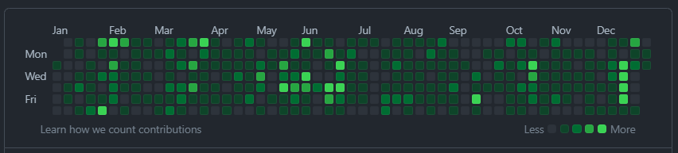
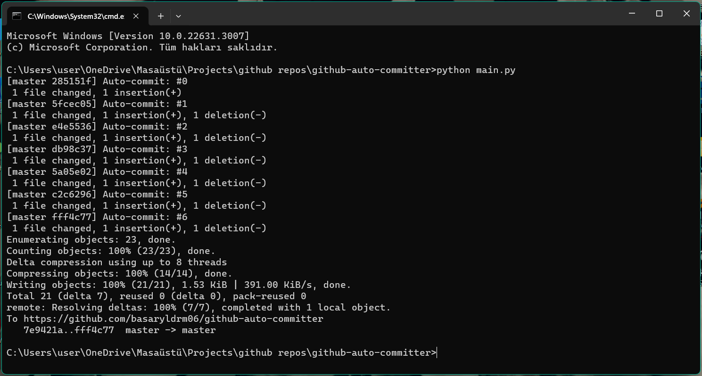

# Github Auto Committer

## Table of Contents
- [Description](#description)
- [How to Use](#how-to-use)
  1. [Installation](#installation)
  2. [Run Python Program](#run-python-program)
  3. [Check the Output](#check-the-output)
  4. [Repeat Everyday](#repeat-everyday)

## Description

This program serves as a tool for individuals who aim to automate their commits, generating a uniformly random commit history table like the one depicted below on GitHub.



## How to Use

1. Installation

    Fork this repository or add it to your existing repository.

2. Run Python Program

    Execute the following command:

    ```bash
    python main.py
    ```

    Ensure that your current directory is a git repository connected to your Git and GitHub.

3. Check the Output

    You should observe an output similar to the one presented below.



4. Repeat Everyday

    Manually repeat these last two steps (2 and 3) every day to maintain a uniformly random commit history table on your profile. 
    Alternatively, seek a method to automate this process as well :)